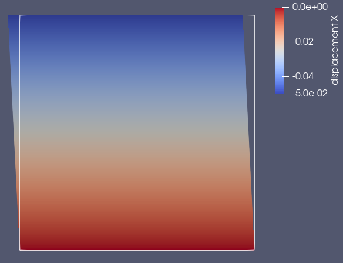
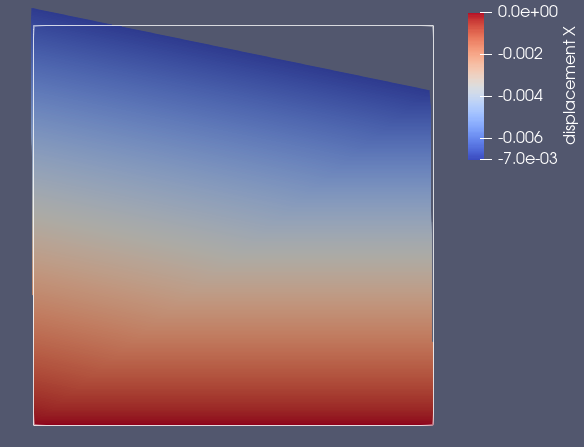
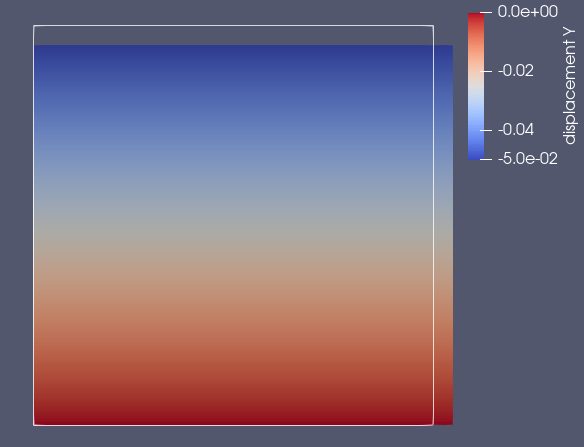
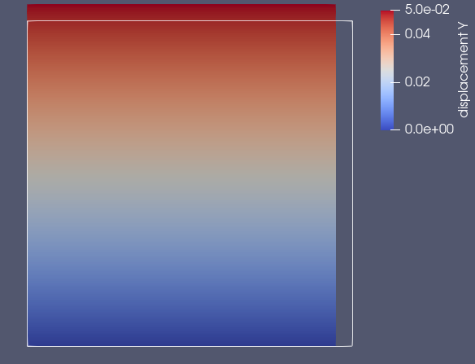
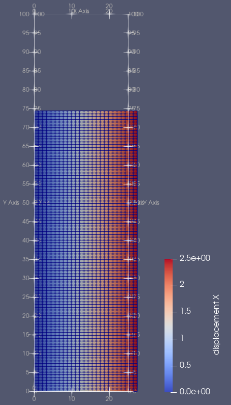
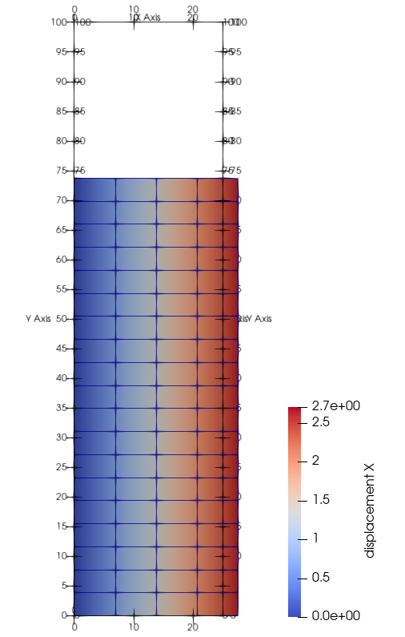
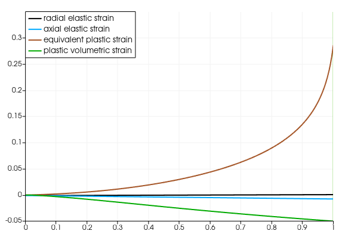
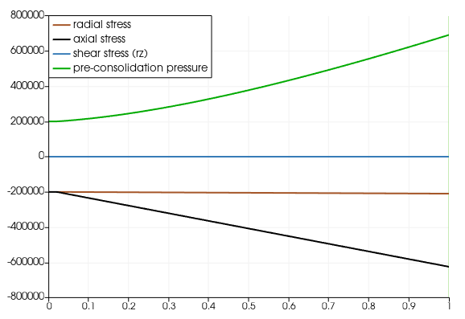
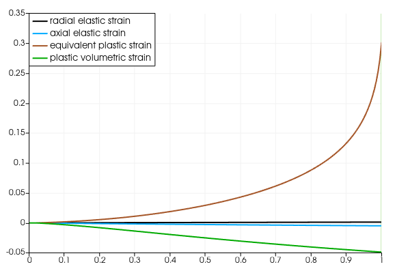

# Introduction {#sec:introduction}

The Cambridge (Cam) clay model
[@Borja1990; @Borja1991; @Borja1998; @Callari1998; @Peric2006] describes
the stress-dependent deformation behaviour of cohesive soils.[^2]
Thereby, effects like

1.  elasto-plastic deformation,

2.  consolidation and irreversible (plastic) pore compaction,

3.  hardening and softening,

4.  different loading and unloading stiffness

can be considered. Typical applications for the Cam clay model are the
calculation of soil strata, for example in geomechanical simulations.
The *modified* Cam clay (MCC) model is characterized by a quadratic
(elliptic) yield surface. The goal of this technical report is a
consistent and clear presentation of the MCC model ready for
implementation and practical use in continuum mechanical simulations
using FEM. Here, the material model interface *MFront* is used. For the
sake of compactness, a symbolic tensor notation is used where the number
of underscores indicates the order of the tensor object.

# Constitutive equations

## Preliminaries

In the small-strain setting, there is an additive split of the linear
strain tensor reading $$\label{eq:elasticplastic}
  \underline{\varepsilon }= \underline{\varepsilon}_\text{e}+ \underline{\varepsilon}_\text{p}\ .$$
The generalized Hooke's law relates elastic strains with stresses as
$$\label{eq:Hooke}
  \underline{\sigma }= \underline{\underline{\,\colon\,}}\underline{\varepsilon}_\text{e}\ .$$
Splitting the stress tensor[^3] with respect to deviatoric and
volumetric parts yields $$\label{eq:decomposition}
  \underline{\sigma }= \underline{\sigma }^\text{D}+ \frac{1}{3}I_1(\underline{\sigma})\underline{I} \ .$$
Therewith, the von-Mises stress and the hydrostatic pressure is defined
as
$$q \coloneqq \sqrt{\frac{3}{2}\ \underline{\sigma}^\text{D}\,\colon\,\underline{\sigma}^\text{D}} \quad,\quad p \coloneqq -\frac{1}{3}I_1(\underline{\sigma}) \ .$$
Consequently, positive values of $p$ represent a pressure whereas
negative values represent hydrostatic tension, as expected. With this,
the stress tensor split reads
$\underline{\sigma }= \underline{\sigma}^\text{D}- p\underline{I}$.
Later, the following derivatives will be required:
$$\frac{\partial q}{\partial \underline{\sigma}} = \frac{3}{2}\ \frac{\underline{\sigma}^\text{D}}{q}\quad,\quad \frac{\partial p}{\partial \underline{\sigma}} = -\frac{1}{3}\ \underline{I} \ .$$
Dealing with porous media there is a kinematic relation between porosity
and volumetric strain. Let the total volume of some representative
elementary volum (REV) be divided into pore volume and solid volume:
$$V = V_{\text{S}} + V_{\text{P}} \ .$$ The porosity is defined as the
pore volume fraction, i. e. $\phi=V_{\text{P}}/V$. Evaluating the mass
balance of the porous medium (incompressible solid phase) yields the
porosity evolution $$\label{eq:porEvolution}
  \dot{\phi} - \phi\mathrm{div}\,(\dot{\vec u}) = \mathrm{tr}\,(\dot{\underline{\varepsilon}})\ .$$
Exploiting
$\mathrm{div}\,(\dot{\vec u})\equiv \mathrm{tr}\,(\dot{\underline{\varepsilon}})=\dot{\varepsilon}^\text{V}$
and separating the variables, this differential equation can be solved
in a straightforward manner (cf. App.).

If the elastic volume changes are small compared to the plastic ones,
the porosity (evolution) can be calculated from
$\varepsilon^\text{V}_\text{p}$ only. Instead of the porosity $\phi$,
the *pore number* $e=V_{\text{P}} / V_{\text{S}}$ (a. k. a. void ratio)
or the *volume ratio* $v=V / V_{\text{S}}$ can equally be used with the
relations $$\label{eq:e-phiRelation}
  e = \frac{\phi}{1-\phi} \quad\text{with}\quad v = 1+e = (1-\phi)^{-1}\ .$$
From [\[eq:porEvolution\]](#eq:porEvolution){reference-type="eqref"
reference="eq:porEvolution"} and
[\[eq:e-phiRelation\]](#eq:e-phiRelation){reference-type="eqref"
reference="eq:e-phiRelation"} useful differential relations follow as
$$\label{eq:diffRelations}
  \text{d}\phi = \frac{\text{d}v}{v^2} \quad\text{and}\quad \text{d}\varepsilon^\text{V} = \frac{\text{d}v}{v} \ .$$

## System of equations

The following set of equations fully describes the modified Cam clay
model. Hooke's law is given in a *hypoelastic* formulation
$$\label{eq:linearHypoElasticity}
  \dot{\underline{\sigma}} = \underline{\underline{D}}\,\colon\,\left(\dot{\underline{\varepsilon}} - \dot{\underline{\varepsilon}}_\text{p}\right) \ .$$
Then, the *modified* Cam clay yield function with the parameters $M$ and
$p_\text{c}$ is given by
$$f \coloneqq q^2 + M p(p-p_\text{c}) \leq 0 \ .$$ Here, $M$ is the
slope of the critical state line and $p_\text{c}$ is the so-called
pre-consolidation pressure. An associated flow rule (normality rule) is
used to obtain the plastic flow as[^4] $$\label{eq:flowRule}
  \dot{\underline{\varepsilon}}_\text{p}= \dot{\varLambda}_\text{p}\ \underline{n} \quad\text{with}\quad \underline{n} =\frac{\underline{m}}{\|\underline{m}\|} \quad,\quad \underline{m} = \frac{\partial f}{\partial \underline{\sigma}} \ ,$$
where $\dot{\varLambda}_\text{p}$ denotes the plastic multiplier such
that $\text{d}{\varLambda}_\text{p}$ is the plastic increment and
$\underline{n}$ gives the direction of the plastic flow. The plastic
volume change rate is obtained from
$$\dot{\varepsilon}_\text{p}^\text{V} = \mathrm{tr}\,(\dot{\underline{\varepsilon}}_\text{p}) = \dot{\varLambda}_\text{p}\,\mathrm{tr}\,(\underline{n})\ . %\tensor I\ppkt\tensor n$$
The pre-consolidation pressure -- the yield stress under isotropic
compression -- evolves: $$\label{eq:evolutionPc}
  \dot{p}_\text{c}= -\dot{\varepsilon}_\text{p}^\text{V} \vartheta(v)\ p_\text{c}\quad\text{with}\quad p_\text{c}\big{|}_{t=0} = p_{\text{c}0} \ .$$
This way, the pre-consolidation pressure increases in case of plastic
compaction, i. e. $\dot{\varepsilon}_\text{p}^\text{V}<0$. Moreover, the
pre-consolidation pressure remains constant during purely elastic
loading. Furthermore, the parameter $\vartheta$ depends on the volume
ratio $v$, which can equally be expressed by the pore number $e$ or the
porosity $\phi$:
$$\vartheta(v) = \frac{v}{\lambda - \kappa} = \frac{1 + e}{\lambda - \kappa} = \overset{\eqref{eq:e-phiRelation}}{=} \frac{1}{(\lambda - \kappa)(1 - \phi)} = \vartheta(\phi) \ ,$$
where the material constants $\lambda, \kappa$ ($\lambda>\kappa$) are
unit-less. Insertion into Eq.
[\[eq:evolutionPc\]](#eq:evolutionPc){reference-type="eqref"
reference="eq:evolutionPc"} leads to $$\label{eq:evolutionPc_ext}
  \dot{p}_\text{c}= -\dot{\varepsilon}_\text{p}^\text{V} \left(\frac{1+e}{\lambda - \kappa}\right)\ p_\text{c}\ .$$
Finally, a *consistent* formulation also requires an evolution equation
for the hydrostatic pressure and the elastic volumetric strain
[@Callari1998]: $$\label{eq:evolutionP}
  \dot{p} = -\dot{\varepsilon}_\text{e}^\text{V} \left(\frac{1+e}{\kappa}\right)\ p \ .$$
With this, the parameters $\lambda$ and $\kappa$ have a well-defined
(experimental) meaning: drawing a semi-logarithmic $v-\ln p$ plot, they
represent the slope of the virgin normal consolidation line and the
normal swelling line, respectively (cf.
[\[subsec:consolidationLine\]](#subsec:consolidationLine){reference-type="autoref"
reference="subsec:consolidationLine"}.

With the porosity (or, equivalently, pore number or volume ratio)
evolution given by formula
[\[eq:diffRelations\]](#eq:diffRelations){reference-type="eqref"
reference="eq:diffRelations"}, the system of constitutive equations for
the Modified Cam Clay Model is closed. This way, all the basic effects
$1.-4.$ (cf.
[\[sec:introduction\]](#sec:introduction){reference-type="autoref"
reference="sec:introduction"}) are captured.

## Kinematic assumptions and consequences of hypoelasticity {#subsec:assumptions}

The (modified) Cam clay model was designed in such a way that it fits
well-known experimental findings. One of such is the normal
consolidation line (NCL). In experiments it is often found that the NCL
in a semi-log plot can be described by the constant slopes $\kappa$ and
$\lambda$ for elastic and plastic loading, respectively.

The MCC model, described by the system of equations given before, can
recover this behavior, which will be shown now.

First, in order to solve the differential equation system analytically,
an important (and admissible) simplification is made [@Peric2006]: The
volume ratio evolution is linearized around the initial value $v_0$. In
a geometrically linear setting this means that $v\approx v_0$. Solving
now [\[eq:diffRelations\]](#eq:diffRelations){reference-type="eqref"
reference="eq:diffRelations"}, the linearized evolution of the volume
ratio reads $$\label{eq:vLinearization}
  \Delta v = v_0\,\Delta\varepsilon^\text{V} \ll 1 \ .$$ The evolution
equations
[\[eq:evolutionPc_ext\]](#eq:evolutionPc_ext){reference-type="eqref"
reference="eq:evolutionPc_ext"} and
[\[eq:evolutionP\]](#eq:evolutionP){reference-type="eqref"
reference="eq:evolutionP"} now become $$\label{eq:linearEvolution}
  \frac{\dot{p}}{p} = -\left(\frac{v_0}{\kappa}\right) \dot{\varepsilon}_\text{e}^\text{V}
  \quad,\quad 
  \frac{\dot{p}_\text{c}}{p_\text{c}} = -\left(\frac{v_0}{\lambda - \kappa}\right)\dot{\varepsilon}_\text{p}^\text{V}
  \ .$$ and can be solved analytically as well. With the relations
[\[eq:elasticplastic\]](#eq:elasticplastic){reference-type="eqref"
reference="eq:elasticplastic"} and
[\[eq:linearEvolution\]](#eq:linearEvolution){reference-type="eqref"
reference="eq:linearEvolution"} the total volume strain rate reads
$$\dot{\varepsilon}^\text{V} = \dot{\varepsilon}_\text{e}^\text{V} + \dot{\varepsilon}_\text{p}^\text{V} 
  = -\frac{1}{v_0}\left\{ \kappa\left(\frac{\dot{p}}{p}-\frac{\dot{p}_\text{c}}{p_\text{c}}\right) +\lambda\frac{\dot{p}_\text{c}}{p_\text{c}} \right\}$$
Under pure elastic compression $\dot{p}_\text{c}= 0$ such that only
$\kappa$ is relevant for the NCL. Under plastic compression
$\dot{p}_\text{c}= \dot{p}$ and $p_\text{c}= p$ holds. Hence, only
$\lambda$ is relevant.

The relation [\[eq:evolutionP\]](#eq:evolutionP){reference-type="eqref"
reference="eq:evolutionP"} or
[\[eq:linearEvolution\]](#eq:linearEvolution){reference-type="eqref"
reference="eq:linearEvolution"} implies that the elastic bulk modulus
becomes a function of hydrostatic pressure. Assuming Poisson's ratio
$\nu$ to be constant,[^5] the compression, shear and elasticity modulus
read[^6] $$\label{eq:elasticParameters}
  K(p) = \frac{v_0}{\kappa}p 
  \quad,\quad
  G(p) =\frac{3(1-2\nu)}{2(1+\nu)}\,K(p) 
  \quad,\quad
  E(p) = 3(1-2\nu)\,K(p)
  \ .$$ Consequently, the elasticity tensor in Hooke's law
[\[eq:Hooke\]](#eq:Hooke){reference-type="eqref" reference="eq:Hooke"}
is not constant, but a function of hydrostatic pressure (where
frequently the *hypoelastic* formulation
[\[eq:linearHypoElasticity\]](#eq:linearHypoElasticity){reference-type="eqref"
reference="eq:linearHypoElasticity"} is chosen). The hypoelastic
relation
[\[eq:linearEvolution\]](#eq:linearEvolution){reference-type="eqref"
reference="eq:linearEvolution"} for the pressure evolution can be solved
analytically using separation of variables:
$$\int\frac{\text{d}p}{p} = - \frac{v_0}{\kappa}\int\text{d}\varepsilon_\text{e}^\text{V} \quad\rightarrow\quad p = p_0 \exp\left(-\frac{v_0}{\kappa}\left(\varepsilon_\text{e}^\text{V}-{}^0\varepsilon_\text{e}^\text{V}\right)\right)  \ .$$
Similarly, integration over time steps is also possible:
$$\label{eq:pIncrementalIntegration}
    {}^{k+1}p = {}^k p \exp\left(-\frac{v_0}{\kappa}\left({}^{k+1}\varepsilon_\text{e}^\text{V}-{}^k\varepsilon_\text{e}^\text{V}\right)\right)$$
No integration of the specific volume is required, cf. assumption above.

To obtain the full stress tensor, the remaining deviatoric part needs to
be found according to decomposition
[\[eq:decomposition\]](#eq:decomposition){reference-type="eqref"
reference="eq:decomposition"}, i. e.
$$\underline{\sigma }= \underline{\sigma}^\text{D}+ (-p) \underline{I} \ .$$
However, recalling the *hypo*elastic formulation, a rate equation must
be solved:
$$\dot{\underline{\sigma}}^\text{D}= 2G(p)\,\dot{\underline{\varepsilon}}_\text{e}^\text{D}\ ,$$
which leads to an incremental determination for the stress deviator. As
a much more simple alternative to a partially incremental scheme, the
fully-incremental procedure can be used integrating the rate-form of
Hooke's law
[\[eq:linearHypoElasticity\]](#eq:linearHypoElasticity){reference-type="eqref"
reference="eq:linearHypoElasticity"} over a time increment
$\varDelta t = {}^{k+1}t - {}^{k}t$ while keeping elastic parameters
constant: $$\label{eq:elasticityTensorFromPreviousPressure}
  \underline{\underline{D}}({}^{k}p) = 2G({}^{k}p) \underline{\underline{J}} + K({}^{k}p) \underline{I}\,\otimes\,\underline{I} \ .$$
with the fourth-order deviatoric projection tensor
$\underline{\underline{J}}$. With this, the stress update reads
$$^{k+1}\underline{\sigma }= {}^{k}\underline{\sigma }+ \underline{\underline{D}}({}^{k}p) : \left({}^{k+1}\underline{\varepsilon}_\text{e}- {}^{k}\underline{\varepsilon}_\text{e}\right) \ .$$
Such an implementation thus uses an elastic stiffness evaluation at the
*previous* time step, which is not fully implicit. However, that also
means that the pressure-dependence does not need to be included in the
Jacobian (cf. next section).[^7]

# Numerical solution

## Total implicit solution scheme

For a time integration with the algorithmic parameter $\theta\in(0,1]$,
the total values at the next instant of time are calculated from the
current values and the increments, i. e. $$\begin{align}
  \underline{\varepsilon}_\text{e}&\coloneqq {}^{k+1}\underline{\varepsilon}_\text{e}= {}^{k}\underline{\varepsilon}_\text{e}+ \theta\varDelta \underline{\varepsilon}_\text{e}\ , \\
  \varLambda_p &\coloneqq {}^{k+1}\varLambda_p = {}^{k}\varLambda_p + \theta\varDelta \varLambda_p\ , \\
  p_\text{c}&\coloneqq {}^{k+1}p_\text{c}= {}^{k}p_\text{c}+ \theta\varDelta p_\text{c}\ , \\
  \phi &\coloneqq {}^{k+1}\phi = {}^{k}\phi + \theta\varDelta\phi \ ,
\end{align}$$ The discretized incremental evolution equation now read
$$\begin{align}
  \varDelta\underline{\varepsilon}_\text{p}&= \varDelta{\varLambda}_\text{p}\ \underline{n}\ , \\
  \varDelta{\varepsilon}_\text{p}^\text{V} &= \varDelta{\varLambda}_\text{p}\,\mathrm{tr}\,(\underline{n})\ , \\  
  \varDelta{p}_\text{c}&= -\varDelta{\varepsilon}_\text{p}^\text{V} \vartheta(\phi)\ p_\text{c}\ , \\
  \varDelta\phi &= (1-\phi) \varDelta\varepsilon^\text{V} \ .
\end{align}$$ With this, the discretized set of equations has the form
$$\label{eq:incrementalSystem}
\begin{align}
  \underline{f}_{\!\varepsilon_\text{e}} &= \varDelta\underline{\varepsilon}_\text{e}+ \varDelta\varLambda_p\ \underline{n} - \varDelta\underline{\varepsilon }= \underline{0} \ ,\\
  f_{\!\varLambda_p} &= q^2 + M^2(p^2 - p\,p_\text{c}) = 0 \ , \label{eq:flp}\\ %\frac{1}{E^2}
  f_{p_\text{c}} &= \varDelta p_\text{c}+ \varDelta\varepsilon_\text{p}^\text{V} \vartheta(\phi)\ p_\text{c}= 0 \ , \label{eq:fpc} \\
  f_{\phi} &= \varDelta\phi - (1-\phi) \varDelta\varepsilon^\text{V} = 0 \ , \label{eq:fphi}
\end{align}$$ where the total values are the values at the next instant
of time, meaning $q={}^{k+1}q$, $p={}^{k+1}p$. For partial derivatives
the functional dependencies are required. They read
$$\label{eq:functionalDependence}
\begin{align}
  \underline{f}_{\!\varepsilon_\text{e}} &= \underline{f}_{\!\varepsilon_\text{e}}(\varDelta\underline{\varepsilon}_\text{e}, \varDelta\varLambda_p, \varDelta p_\text{c}) \ ,\\
  f_{\!\varLambda_p} &= f_{\varLambda_p}(\varDelta\underline{\varepsilon}_\text{e}, \varDelta p_\text{c}) \ , \\
  f_{p_\text{c}} &= f_{p_\text{c}}(\varDelta\underline{\varepsilon}_\text{e}, \varDelta\varLambda_p, \varDelta p_\text{c}, \varDelta\phi)\ , \\
  f_{\phi} &= f_{\phi}(\varDelta\phi) \ ,
\end{align}$$ where it was taken into account, that
$q(\underline{\sigma}), p(\underline{\sigma})$ and
$\underline{\sigma}(\varDelta\underline{\varepsilon}_\text{e})$,
$\underline{n}(q, p, p_\text{c})$ and
$\varDelta\varepsilon_\text{p}^\text{V}(\varDelta\varLambda_p, \underline{n})$.

For the solution of the incremental set of equations
[\[eq:incrementalSystem\]](#eq:incrementalSystem){reference-type="eqref"
reference="eq:incrementalSystem"} with the Newton-Raphson method the
partial derivatives with respect to the increments of the unknowns are
required. They read $$\label{eqset:partialDerivatives}
\begin{align}
  \frac{\partial\underline{f}_{\!\varepsilon_\text{e}}}{\partial\varDelta\underline{\varepsilon}_\text{e}} &= \underline{\underline{I}} + \varDelta\varLambda_p\frac{\partial\underline{n}}{\partial\varDelta\underline{\varepsilon}_\text{e}} \quad\text{with}\quad \underline{\underline{I}}=\vec e_a\,\otimes\,\vec e_b\,\otimes\,\vec e_a\,\otimes\,\vec e_b \ ,
  \\
  \frac{\partial\underline{f}_{\!\varepsilon_\text{e}}}{\partial\varDelta\varLambda_p} &= \underline{n}\ ,
  \\
  \frac{\partial\underline{f}_{\!\varepsilon_\text{e}}}{\partial\varDelta p_\text{c}} &= \varDelta\varLambda_p \ \frac{\partial\underline{n}}{\partial\varDelta p_\text{c}} ,
  \\[2mm]
  \frac{\partial f_{\!\varLambda_p}}{\partial\varDelta\underline{\varepsilon}_\text{e}} &= \frac{\partial f_{\!\varLambda_p}}{\partial \underline{\sigma}} : \frac{\partial \underline{\sigma}}{\partial \underline{\varepsilon}_\text{e}} : \frac{\partial\underline{\varepsilon}_\text{e}}{\partial\varDelta\underline{\varepsilon}_\text{e}} = \underline{m} : \underline{\underline{\ }}\theta\ , %: \theta\tensorf I
  \\
  \frac{\partial f_{\!\varLambda_p}}{\partial\varDelta p_\text{c}} &= \frac{f_{\!\varLambda_p}}{\partial p_\text{c}}\ \frac{\partial p_\text{c}}{\partial \varDelta p_\text{c}}
                                                              = -p M^2\, \theta\ , 
  \\[2mm]
  \frac{\partial f_{p_\text{c}}}{\partial\varDelta\underline{\varepsilon}_\text{e}} &= \frac{\partial f_{p_\text{c}}}{\partial\underline{n}} : \frac{\partial\underline{n}}{\partial\varDelta\underline{\varepsilon}_\text{e}}\ , 
  \\
  \frac{\partial f_{p_\text{c}}}{\partial\varDelta\varLambda_p} &= \frac{\partial f_{p_\text{c}}}{\partial\varDelta\varepsilon_\text{p}^\text{V}}\ \frac{\partial\varDelta\varepsilon_\text{p}^\text{V}}{\partial\varLambda_p} = \vartheta p_\text{c}\,\mathrm{tr}\,(\underline{n})\ ,
  \\
  \frac{\partial f_{p_\text{c}}}{\partial\varDelta p_\text{c}} &= 1 + \vartheta\varDelta\varepsilon_\text{p}^\text{V}\theta + \frac{\partial f_{p_\text{c}}}{\partial\underline{n}} : \frac{\partial\underline{n}}{\partial\varDelta p_\text{c}}\ ,
  \\
  \frac{\partial f_{p_\text{c}}}{\partial\varDelta\phi} &= \varDelta\varepsilon_\text{p}^\text{V} p_\text{c}\frac{\partial\vartheta(\phi)}{\partial\phi}\ \frac{\partial\phi}{\partial\varDelta\phi} 
                                                   = \frac{\varDelta\varepsilon_\text{p}^\text{V} p_\text{c}\,\theta }{(\lambda - \kappa)(1 - \phi)^2}\ 
                                                   = \frac{\varDelta\varepsilon_\text{p}^\text{V} p_\text{c}\,\vartheta\,\theta }{(1 - \phi)}\ , 
  \\[2mm]
  \frac{\partial f_{\phi}}{\partial\varDelta\phi} &= 1 + \theta\varDelta\varepsilon^\text{V} \ .
\end{align}$$ All other partial derivatives vanish according to the
(missing) dependencies
[\[eq:functionalDependence\]](#eq:functionalDependence){reference-type="eqref"
reference="eq:functionalDependence"}. Using the normalized flow
direction $\underline{n}$, the derivatives with respect to some variable
$X$ can be obtained with the following rule: $$\begin{aligned}
  \frac{\partial\underline{n}}{\partial X} = \frac{1}{m}\left\{\frac{\partial\underline{m}}{\partial X} - \frac{1}{2}\,\underline{n}\,\otimes\,\frac{1}{m}\frac{\partial m^2}{\partial X} \right\}\quad\text{with}\quad m=\|\underline{m}\| \ .
\end{aligned}$$ Now, the missing expressions in overview
[\[eqset:partialDerivatives\]](#eqset:partialDerivatives){reference-type="eqref"
reference="eqset:partialDerivatives"} can be calculated as
$$\begin{align}
  \underline{m} &= \frac{\partial f}{\partial \underline{\sigma}} = \frac{\partial f}{\partial q}\,\frac{\partial q}{\partial \underline{\sigma}} +\frac{\partial f}{\partial p}\,\frac{\partial p}{\partial \underline{\sigma}} 
  = 3\underline{\sigma}^\text{D}- \frac{M^2}{3}(2p-p_\text{c}) \underline{I} \ , 
  \\
  m^2 &= \underline{m} : \underline{m} = 6q^2 + \frac{M^4}{3}(2p-p_\text{c})^2 \qquad , \quad \underline{n} = \underline{m}/m \ , 
  \\
  \frac{\partial\underline{m}}{\partial\underline{\varepsilon}_\text{e}} &= \left\{ \frac{\partial\underline{m}}{\partial q}\,\otimes\,\frac{\partial q}{\partial \underline{\sigma}} + \frac{\partial\underline{m}}{\partial p}\,\otimes\,\frac{\partial p}{\partial \underline{\sigma}} \right\} : \frac{\partial \underline{\sigma}}{\partial \underline{\varepsilon}_\text{e}}
  = \left\{ 3\underline{\underline{P}} + \frac{2}{9} M^2 \underline{I}\,\otimes\,\underline{I} \right\} : \underline{\underline{\ }}, 
  \\
  \frac{\partial m^2}{\partial\underline{\varepsilon}_\text{e}} &= \left\{ \frac{\partial m^2}{\partial q}\,\frac{\partial q}{\partial \underline{\sigma}} +\frac{\partial m^2}{\partial p}\,\frac{\partial p}{\partial \underline{\sigma}} \right\} : \frac{\partial \underline{\sigma}}{\partial \underline{\varepsilon}_\text{e}} 
  = \left\{ 18\underline{\sigma}^\text{D}- \frac{4}{9} M^4 (2p-p_\text{c})\underline{I} \right\} : \underline{\underline{\ }}, 
  \\
  \frac{\partial\underline{n}}{\partial\varDelta\underline{\varepsilon}_\text{e}} &= 
  \frac{1}{m}\left\{\frac{\partial\underline{m}}{\partial\underline{\varepsilon}_\text{e}} - \frac{1}{2}\,\underline{n}\,\otimes\,\frac{1}{m}\frac{\partial m^2}{\partial\underline{\varepsilon}_\text{e}} \right\} :  
  \frac{\partial\underline{\varepsilon}_\text{e}}{\partial\varDelta\underline{\varepsilon}_\text{e}} \ ,
  \\
  \frac{\partial\underline{n}}{\partial\varDelta p_\text{c}} &= 
  \frac{1}{m}\left\{\frac{\partial\underline{m}}{\partial p_\text{c}} - \frac{1}{2}\,\underline{n}\,\otimes\,\frac{1}{m}\frac{\partial m^2}{\partial p_\text{c}} \right\} 
  \frac{\partial p_\text{c}}{\partial\varDelta p_\text{c}} = \frac{M^2}{3m}\left\{\underline{I} + M^2(2p-p_\text{c})\,\underline{n}/m \right\} \theta\ , 
  \\
  \frac{\partial f_{p_\text{c}}}{\partial\underline{n}} &= \frac{f_{p_\text{c}}}{\partial\varDelta\varepsilon_\text{p}^\text{V}}\, \frac{\partial\varDelta\varepsilon_\text{p}^\text{V}}{\partial\underline{n}} 
                                            = p_\text{c}\vartheta\ \varDelta\varLambda_p \underline{I} \ .
\end{align}$$ The solution of system
[\[eq:incrementalSystem\]](#eq:incrementalSystem){reference-type="eqref"
reference="eq:incrementalSystem"} can be accomplished based on the
Karush-Kuhn-Tucker conditions with an elastic predictor and a plastic
corrector step. This leads to a radial return mapping algorithm (also
known as active set search), as will be used in
[\[subsec:ImplementationConstE\]](#subsec:ImplementationConstE){reference-type="autoref"
reference="subsec:ImplementationConstE"} and
[4.2](#subsec:ImplementationOriginal){reference-type="ref"
reference="subsec:ImplementationOriginal"}. Alternatively, the case
distinction can be avoided using the Fischer-Burmeister complementary
condition [cf. e. g. @Ashrafi2016; @Bartel2019]. Both methods can be
used in *MFront* [@Helfer2015; @Helfer2020].

## Numerical refinement and stabilization {#subsec:stabilization}

It is recommended to normalize all residuals
[\[eq:incrementalSystem\]](#eq:incrementalSystem){reference-type="eqref"
reference="eq:incrementalSystem"} to some similar order of magnitude,
e. g. as strains. For this, equation
[\[eq:flp\]](#eq:flp){reference-type="eqref" reference="eq:flp"} can be
divided by some characteristic value $\hat{f}$: $$\begin{aligned}
  f_{\!\varLambda_p} &= f / \hat{f} = \left\{q^2 + M^2(p^2 - p\,p_\text{c})\right\} / (E\,\hat{p}_\text{c}) \ .
  %f_{p_\c} &= \left\{ \varDelta p_\c + \varDelta\varepsilon_\p^\text{V} \vartheta(\phi)\ p_\c \right\} / E
\end{aligned}$$ Here $\hat{f} = E\,\hat{p}_\text{c}= E\,p_{\text{c}0}$
was chosen with the elastic modulus and the initial value of the
pre-consolidation pressure as the characteristic pressure
$\hat{p}_\text{c}$. Of course, this has to be considered in the
corresponding partial derivatives
([\[eqset:partialDerivatives\]](#eqset:partialDerivatives){reference-type="ref"
reference="eqset:partialDerivatives"}d--f). Instead of applying the same
procedure to $f_{p_\text{c}}$ it is advantageous to directly normalize
the corresponding independent variable $p_\text{c}$. Then, the new
reduced integration variable is
$$p_\text{c}^r\coloneqq p_\text{c}/ \hat{p}_\text{c}= p_\text{c}/ p_{\text{c}0} \ .$$
Thus, the partial derivatives with respect to $p_\text{c}$ have to be
replaced as
$$\frac{\partial (\ast)}{\partial p_\text{c}} \rightarrow \frac{\partial (\ast)}{\partial p_\text{c}^r} = \frac{1}{\hat{p}_\text{c}} \frac{\partial (\ast)}{\partial p_\text{c}} \ .$$
Consequently, all integration variables
$\underline{\varepsilon}_\text{e}, \varLambda_p, p_\text{c}^r, \phi$ are
dimensionless, strain-like variables, which improves the condition
number of the set of equations.

It is important to note that the Cam clay model is, in general, only
valid for hydrostatic pressures $p<0$, i. e. isotropic tension is not
possible because then the elastic parameters
[\[eq:elasticParameters\]](#eq:elasticParameters){reference-type="eqref"
reference="eq:elasticParameters"} take unphysical values. This is no
drawback, but it reflects the nature of the soil material to be
modelled. For the numerical simulation this means, that the possible
trajectories in the stress space are confined to the region with $p>0$.
For the simulation to proceed from some initial state, an initial
hydrostatic pressure must be present.

In order to stabilize the numerical behaviour two more minor
modifications are beneficial. The first one regards some (initial) state
with zero stress. Then $f=0$ is indicating potential plastic loading,
but plastic flow [\[eq:flowRule\]](#eq:flowRule){reference-type="eqref"
reference="eq:flowRule"} is undetermined. To prevent this case, a small
(ambient) pressure $p_\text{amb}$ can be added to the hydrostatic
pressure, i. e.
$$p \coloneqq -I_1(\underline{\sigma})/3 + p_\text{amb} \ .$$ Hence, a
minimum (initial) elastic range is provided. However, this pressure
shift will cause discrepancies for low pressure values in the in the
vicinity of $p_\text{amb}$.

Another problem occurs in case of strong softening and dilatancy:
$p_\text{c}\rightarrow 0$ and the yield surface contracts until it
degenerates to a single point such that the direction of plastic flow is
undefined. In order to limit the decrease of $p_\text{c}$ to some
minimal pre-consolidation pressure $p^\text{min}_\text{c}$, the
evolution equation
[\[eq:evolutionPc\]](#eq:evolutionPc){reference-type="eqref"
reference="eq:evolutionPc"} is modified to $$\label{eq:pcMin}
  \dot{p}_\text{c}= -\dot{\varepsilon}_\text{p}^\text{V} \vartheta(\phi)\ (p_\text{c}- p^\text{min}_\text{c}) \quad\text{with}\quad p_\text{c}\big{|}_{t=0} = p_{\text{c}0} \ ,$$
where the normalization from above can be applied again. A reasonably
small value for $p^\text{min}_\text{c}$ can be the ambient atmospheric
pressure or a fixed fraction (e. g. $10^{-3}$) of $\hat{p}_\text{c}$.
The modifications need to be considered in
Eq. [\[eq:fpc\]](#eq:fpc){reference-type="eqref" reference="eq:fpc"} and
its derivatives.

## Linear or non-linear porosity evolution {#subsec:PorosityEvolution}

The number of equations in System
[\[eq:incrementalSystem\]](#eq:incrementalSystem){reference-type="eqref"
reference="eq:incrementalSystem"} can be reduced exploiting the minor
influence of the porosity/volume ratio. Two ways are presented here.

### Linearized porosity evolution and fully-implicit solution scheme

Since the model is formulated with respect to a geometrically linear
setting, the strains (must) remain small and so do the porosity
increments. It is only consequent then, to linearize the porosity
evolution according to formula
[\[eq:vLinearization\]](#eq:vLinearization){reference-type="eqref"
reference="eq:vLinearization"}: the volume ratio itself then follows the
linear evolution $${}^{k+1}v = {}^{k}v + v_0 \Delta\varepsilon^\text{V} 
  \quad\text{with}\quad v\big{|}_{t=0} = v_{0} \ .$$ In all other
equations, it is kept constant with $v\approx v_0$. Consequently, the
(minor) porosity/volume ratio evolution has no effect on any other
equation. Thus, the residual equation
[\[eq:fphi\]](#eq:fphi){reference-type="eqref" reference="eq:fphi"} and
the corresponding derivatives can be omitted. Moreover, the volume ratio
can be updated at the end of the time step while the integration scheme
still is fully-implicit. The pore number or porosity -- if desired --
follow directly from
$$1 + \,{}^{k+1}\!e = {}^{k+1}\!v = (1-\, {}^{k+1}\!\phi)^{{-1}} 
  %\quad\with\quad 1-\phi = (1-{}^{0}\!\phi) \exp(\minus\varepsilon^\text{V})
   \ .$$

### Non-linear porosity evolution and semi-explicit solution scheme

Integrating the non-linear relation
[\[eq:diffRelations\]](#eq:diffRelations){reference-type="eqref"
reference="eq:diffRelations"} between volume ratio and volumetric strain
yields the evolution $$\begin{aligned}
  {}^{k+1}\!v = {}^{k}\!v\, \exp(\Delta\varepsilon^\text{V}) \ .
\end{aligned}$$ Equivalently, Eq.
[\[eq:porEvolution\]](#eq:porEvolution){reference-type="eqref"
reference="eq:porEvolution"} for the porosity and the solution
[\[eq:evolutionPhi\]](#eq:evolutionPhi){reference-type="eqref"
reference="eq:evolutionPhi"} derived in Appendix
[7.3](#subsec:AppSolutionPorosity){reference-type="ref"
reference="subsec:AppSolutionPorosity"} can be used. Even if no further
linearizing assumption is made, the influence of the volume ratio change
in a time step is minor. Since $v$ usually does not significantly change
during the strain increment, it can be updated explicitly at the end of
the time step [@Borja1990]. Thus, the residual equation
[\[eq:fphi\]](#eq:fphi){reference-type="eqref" reference="eq:fphi"} and
the corresponding derivatives can be omitted, again.

## Forcing linear elastic behavior with constant parameters {#subsec:linear_elastic}

The evolution equation
[\[eq:evolutionP\]](#eq:evolutionP){reference-type="eqref"
reference="eq:evolutionP"} for the hydrostatic pressure causes a
nonlinear *hypo*elastic behavior of the MCC model, which has some
drawbacks: As a consequence, the compression modulus becomes
load-path-dependent. This is thermodynamically inconsistent with the
notion of simple (Cauchy) elasticity [@Borja1998]. It also seems
counter-intuitive that the bulk modulus should increase with the volume
ratio/pore number according to
Eq. [\[eq:elasticParameters\]](#eq:elasticParameters){reference-type="eqref"
reference="eq:elasticParameters"}. For these reasons and for the sake of
simplicity, constant elastic parameters can be forced. This means
instead of [\[eq:evolutionP\]](#eq:evolutionP){reference-type="eqref"
reference="eq:evolutionP"} holds $$\label{eq:constK}
  \dot{p} = -\dot{\varepsilon}_\text{e}^\text{V}\ K \ ,$$ which is
automatically fulfilled applying linear elasticity with a constant bulk
modulus $K$. Then, there is no need for the rate formulation
[\[eq:linearHypoElasticity\]](#eq:linearHypoElasticity){reference-type="eqref"
reference="eq:linearHypoElasticity"} and Hooke's law is given by
[\[eq:Hooke\]](#eq:Hooke){reference-type="eqref" reference="eq:Hooke"}.
Hence, the elastic behavior is *hyper*elastic and thus also
thermodynamically consistent.[^8]

However, keeping the elastic material parameters constant makes the
model inconsistent at another place: the intrinsic relation between the
parameters $\kappa$ and $K$ is lost. Instead, these parameters are now
independent rendering the model over-parameterized. Prescribing the
elastic constants $E, \nu$ and assuming an initial hydrostatic pressure
$p_0$, the normal swelling line slope $\kappa$ should hence be chosen as
$$\label{eq:relationE-kappa}
  \kappa = v_0\frac{p_0}{K} = v_0\cdot 3(1-2\nu) \frac{p_0}{E}
         = 3 \frac{(1-2\nu)}{1-\phi_0} \frac{p_0}{E}\ .$$ Nevertheless,
the hardening behaviour will be a bit different (cf.
[\[subsec:consolidationLine\]](#subsec:consolidationLine){reference-type="autoref"
reference="subsec:consolidationLine"}).

# Implementation into *MFront*

## MCC model with constant elasticity {#subsec:ImplementationConstE}

For the *MFront* implementation the domain specific language (DSL)
`Implicit` was used, cf. [@Helfer2015; @Marois2020]. The coupling to
*OpenGeoSys* [@Kolditz2012a; @Bilke2019] is done using MGIS
[@Helfer2020]. The implementation is part of the *OpenGeoSys* source
code, cf. <https://gitlab.opengeosys.org>.

In the preamble of the *MFront* code the parameters are specified and
integration variables are declared. Note that a *state variable* is a
persistent variable and an integration variable, whereas an *auxiliary
state variable* is also persistent but no integration variable.

``` {.c++ language="C++"}
// environmental parameters (default values)
@Parameter stress pamb = 1e+3; //Pa
@PhysicalBounds pamb in [0:*[;
pamb.setEntryName("AmbientPressure");

// material parameters
@MaterialProperty stress young;
@PhysicalBounds young in [0:*[;
young.setGlossaryName("YoungModulus");
...
// state variables (beside eel):
@StateVariable real lp;
lp.setGlossaryName("EquivalentPlasticStrain");
@IntegrationVariable strain rpc;
@AuxiliaryStateVariable stress pc;
pc.setEntryName("PreConsolidationPressure");
@AuxiliaryStateVariable real epl_V;
epl_V.setEntryName("PlasticVolumetricStrain");
@AuxiliaryStateVariable real v;
v.setEntryName("VolumeRatio");  
...
```

The semi-explicit solution scheme is then implemented with three basic
steps:

``` {.c++ language="C++"}
@InitLocalVariables{
  //elastic predictor step
}
@Integrator{
  //plastic corrector step
}
@UpdateAuxiliaryStateVariables{
  //explicit volume ratio update
}
```

Note that for a consistent initial state of the material integration,
the initial elastic strain has to be calculated from the given initial
stress at the beginning of the simulation.

## MCC model with original non-linear elasticity {#subsec:ImplementationOriginal}

In contrast to the *absolute* formulation presented above, an
*incremental* formulation yields the most compact implementation in case
of nonlinear (hypo)elasticity. The definition of parameters and state
variables is just as above, with the only difference that there is no
Young modulus to be defined and no (numerical) ambient pressure is used
(cf.
[\[subsec:stabilization\]](#subsec:stabilization){reference-type="autoref"
reference="subsec:stabilization"}). The solution scheme has two more
incredients before and after the plastic corrector step:

``` {.c++ language="C++"}
...
@ComputeStress {
    // incremental stress update
    sig = sig0 + theta * dsig_deel * deel;
}
@Integrator{
    // plastic corrector step
    ...
}
@ComputeFinalStress {
    // updating the stress at the end of the time step
    sig = sig0 + dsig_deel * deel;
}
...
```

Notably, the calculation of the Jacobian during the plastic corrector
step does not change in case of using Eq.
[\[eq:elasticityTensorFromPreviousPressure\]](#eq:elasticityTensorFromPreviousPressure){reference-type="eqref"
reference="eq:elasticityTensorFromPreviousPressure"}, i. e. taking the
previous pressure for calculating the elastic parameters. In addition to
the steps already mentioned, the tangent operator has to be specified
according to

``` {.c++ language="C++"}
@TangentOperator // because no Brick StandardElasticity
{
    if ((smt == ELASTIC) || (smt == SECANTOPERATOR))
    {
        Dt = dsig_deel;
    }
    ...
}
```

Additional convergence checks can be used for excluding unphysical
behavior, e. g. negative plastic increments. For the implementation to
work properly, the initial state must be characterized by $p>0$ (cf.
[\[subsec:stabilization\]](#subsec:stabilization){reference-type="autoref"
reference="subsec:stabilization"}).[^9] Otherwise, the following error
message will occur:

``` {.c++ language="C++"}
ModCamClay_semiExplParaInitNLnu_inc::integrate() : computFdF 
returned false or the norm of the residual is not finite
```

# Numerical studies

## Isotropic compression and consolidation line test using *mtest* {#subsec:consolidationLine}

*MFront* provides the tool *mtest* for testing the implemented material
behaviour at a single material point (integration point), see
[@Helfer2015]. For this, complex loading sequences can be prescribed in
terms of stress and strain trajectories.

There is a significant difference between the *original* Modified Cam
Clay model
([\[subsec:ImplementationOriginal\]](#subsec:ImplementationOriginal){reference-type="autoref"
reference="subsec:ImplementationOriginal"}) and the MCC version with
constant elastic parameters
([\[subsec:ImplementationConstE\]](#subsec:ImplementationConstE){reference-type="autoref"
reference="subsec:ImplementationConstE"}). In order to work this out,
the models' behavior under isotropic compression is compared. As a
result, the normal consolidation line (NCL) is obtained. For the
original MCC model there is an analytical solution: in the semi-log plot
the $v$ -- $p$ curve consists of straight lines with the slopes
$\lambda$ (virgin consolidation line) and $\kappa$ (swelling line). This
will be derived now.

The original MCC evolution equations for the pressure and the
pre-consolidation pressure
[\[eq:linearEvolution\]](#eq:linearEvolution){reference-type="eqref"
reference="eq:linearEvolution"} can be integrated easily by separation
of variables. Assuming zero initial volume strains and the initial
values $p_0$ and $p_\text{c0}$, we get the expressions
$${\varepsilon}_\text{e}^\text{V} = -\left(\frac{\kappa}{v_0}\right)\ln\left(\frac{p}{p_0}\right)
  \quad,\quad 
  {\varepsilon}_\text{e}^\text{V} = -\left(\frac{\lambda-\kappa}{v_0}\right) \ln\left(\frac{p_\text{c}}{p_\text{c0}}\right)
  \ . \\$$ With the additive composition of the total volumetric strain,
i. e.
${\varepsilon}^\text{V} = {\varepsilon}_\text{e}^\text{V} + {\varepsilon}_\text{p}^\text{V}$
and with the linear kinematic relation
$v - v_0 = v_0 \varepsilon^\text{V}$ we finally get
$$v = v_0 - \kappa\ln\left(\frac{p}{p_0}\right) - (\lambda-\kappa) \ln\left(\frac{p_\text{c}}{p_\text{c0}}\right)
  \ . \\$$ This is an analytical solution holding for small changes of
the volume ratio, i.e. $v\approx v_0$. Now, monotonic loading is
considered for a stress-controlled isotropic compression test. Starting
from the state $(p_0, v_0)$ with
$$p=p_0, p_\text{c}=p_\text{c0} \quad\rightarrow\quad v = v_0$$ the
pressure is increased monotonically and the behavior is elastic until
reaching the pre-consolidation pressure (the yield stress under
isotropic compression) when
$$p=p_\text{c0}, p_\text{c}=p_\text{c0} \quad\rightarrow\quad v = v_0 - \kappa\ln\left(\frac{p_\text{c0}}{p_0}\right) \ .$$
Further increasing the pressure in the elastic-plastic region up to some
end value $p=p_\text{E}>p_\text{c0}$, the final state is
$$p=p_\text{E}, p_\text{c}=p_\text{E} \quad\rightarrow\quad v = v_0 - \kappa\ln\left(\frac{p_\text{E}}{p_0}\right) - (\lambda-\kappa) \ln\left(\frac{p_\text{E}}{p_\text{c0}}\right) \ .$$
Between these points, the solution is a straight line in the semi-log
space. To be precise, we choose $p_0 = p_\text{c0} / 4$,
$p_\text{E} = 2 p_\text{c0}$ yielding the initial over-consolidation
ratio $p_\text{c0}/p_0=4$.

The material parameters are given in
[\[tab:matParaCamClay0\]](#tab:matParaCamClay0){reference-type="autoref"
reference="tab:matParaCamClay0"}.

::: {#tab:matParaCamClay0}
   $\nu$    $M$        $\lambda$             $\kappa$         $v_0$     $p_{\text{c}0}$ / Pa        
  ------- ------- -------------------- -------------------- ---------- ---------------------- -- -- --
   $0.3$   $1.2$   $7.7\cdot 10^{-2}$   $6.6\cdot 10^{-3}$   $1.7857$     $200\cdot10^{3}$          
                                                                                                    

  : Material parameters and initial values for the modified Cam clay
  model
:::

In order to make the MCC models with pressure-dependent elasticity
(Original) and with constant elastic parameters *initially* consistent,
$E$ cannot be chosen arbitrarily in
[4.1](#subsec:ImplementationConstE){reference-type="ref"
reference="subsec:ImplementationConstE"}, but according to Eq.
[\[eq:relationE-kappa\]](#eq:relationE-kappa){reference-type="eqref"
reference="eq:relationE-kappa"}, i. e.
$$E = 3(1-2\nu) K = v_0\cdot 3(1-2\nu) \frac{p_0}{\kappa} = 3 \frac{(1-2\nu)}{(1-\phi_0)} \frac{p_0}{\kappa} \ .$$
Furthermore, no ambient pressure is used, cf.
[\[subsec:stabilization\]](#subsec:stabilization){reference-type="autoref"
reference="subsec:stabilization"}.

<figure id="fig:Comparison_NCL_MCC_OCR">
<embed
src="img/SemiExplicitModifiedCamClay_OpenGeoSys2023/Comparison_NCL_MCC_new_OCR=4.pdf"
style="width:80.0%" />
<figcaption>Normal consolidation line: analytical and numerical solution
for the original MCC model (pressure-dependent elasticity) versus
numerical solution with the basic version (constant elastic parameters).
Note the logarithmic p-axis.</figcaption>
</figure>

[\[fig:Comparison_NCL_MCC_OCR\]](#fig:Comparison_NCL_MCC_OCR){reference-type="autoref"
reference="fig:Comparison_NCL_MCC_OCR"} shows the perfect fit of
analytical and numerical solution for the original MCC model
[4.2](#subsec:ImplementationOriginal){reference-type="ref"
reference="subsec:ImplementationOriginal"} with pressure-dependent
elastic parameters. However, the version
[4.1](#subsec:ImplementationConstE){reference-type="ref"
reference="subsec:ImplementationConstE"} with constant elastic
parameters (cf.
[\[subsec:linear_elastic\]](#subsec:linear_elastic){reference-type="autoref"
reference="subsec:linear_elastic"}) significantly deviates. Hence, the
basic version should not be used for this kind of test (if the typical
Cam clay behavior is expected). Instead, the basic version can be used
very well if stress paths with high deviatoric proportion are present
(cf. triaxial test in
[\[subsec:triaxialCompression\]](#subsec:triaxialCompression){reference-type="autoref"
reference="subsec:triaxialCompression"}).

## Consolidated plane strain simple shear test using *mtest* {#subsec:mtestResults}

In order to test the consolidation behaviour, plane strain simple shear
tests were conducted with the same initial state but three different
loading trajectories. To be precise, first the hydrostatic pressure $p$
was increased until $0.25\,p_{\text{c}0}, 0.5\,p_{\text{c}0}$ or
$0.75\,p_{\text{c}0}$. This results in the overconsolidation ratios (OCR
$=p_{\text{c}0}/p$) of $4, 2, 4/3$. From this hydrostatic stress state,
shear is applied up to the strain $\varepsilon_{xy}=0.01$.

::: {#tab:matParaCamClay}
       $E$ / Pa       $\nu$    $M$        $\lambda$             $\kappa$         $v_0$    $p_{\text{c}0}$ / Pa   $p_\text{amb}$ / Pa     
  ------------------ ------- ------- -------------------- -------------------- --------- ---------------------- --------------------- -- --
   $150\cdot10^{9}$   $0.3$   $1.5$   $7.7\cdot 10^{-3}$   $6.6\cdot 10^{-4}$   $1.788$     $30\cdot10^{6}$        $0\cdot10^{3}$        
                                                                                                                                         

  : Material parameters for the modified Cam clay model implementation
  [4.1](#subsec:ImplementationConstE){reference-type="ref"
  reference="subsec:ImplementationConstE"}
:::

Implementation [4.1](#subsec:ImplementationConstE){reference-type="ref"
reference="subsec:ImplementationConstE"} is used, material parameters
and initial values are given in
[\[tab:matParaCamClay\]](#tab:matParaCamClay){reference-type="autoref"
reference="tab:matParaCamClay"}. Note that only the difference
$\lambda - \kappa$ plays a role in the implementation with *constant*
elastic parameters. Considering the OCR, there are three different cases
(cf.
[\[fig:mtestShear3cases\]](#fig:mtestShear3cases){reference-type="autoref"
reference="fig:mtestShear3cases"}):

<figure id="fig:mtestShear3cases">
<p><embed
src="img/SemiExplicitModifiedCamClay_OpenGeoSys2023/ModCamClay_ParamStudy_ShearCurves_pStudy.pdf"
style="width:60.0%" /> <embed
src="img/SemiExplicitModifiedCamClay_OpenGeoSys2023/ModCamClay_ParamStudy_eplVCurves_pStudy.pdf"
style="width:60.0%" /></p>
<figcaption>Consolidated shear test for three typical OCR values: <span
class="math inline"><em>ε</em><sub>p</sub><sup>V</sup> &gt; 0</span>
causes softening, whereas <span
class="math inline"><em>ε</em><sub>p</sub><sup>V</sup> &lt; 0</span>
(compaction) results in hardening.</figcaption>
</figure>

For $\text{OCR}>2$ the shearing is accompanied by a plastic expansion
(dilatancy) with $\varepsilon_\text{p}^\text{V}>0$, which is related to
softening until the critical state is reached.

For $\text{OCR}=2$ shearing until yield leads directly to the critical
state. Considering the state of the soil (porosity, stress, volume) this
is a natural asymptotic state. Further shearing does not alter that
state anymore. Hence, there is ideal plastic behaviour.

For $\text{OCR}<2$ the shearing is accompanied by a plastic compaction
(contractant flow, consolidation) with
$\varepsilon_\text{p}^\text{V}<0$, which is related to hardening until
the critical state is reached.

The stress trajectories, and the final yield surfaces are illustrated in
the $p,q$-space together with the initial yield surface and the critical
state line (CSL).

<figure id="fig:mtestShear3casesYield">
<embed
src="img/SemiExplicitModifiedCamClay_OpenGeoSys2023/ModCamClay_ParamStudy_YieldSurface_pStudy.pdf"
style="width:61.0%" />
<figcaption>Consolidated shear test for 3 typical OCR values: depicted
are the different stress trajectories, the critical state line (CSL) and
the final yield surfaces.</figcaption>
</figure>

Now, the same consolidated shear loading is applied, but with two
different initial states: a high initial pre-consolidation pressure
$p_{\text{c}0}$ resembles a heavily pre-consolidated, compacted (dense)
soil material, whereas a low value of $p_{\text{c}0}$ resembles a
loosened initial state.

<figure id="fig:mtestShear2cases">
<p><embed
src="img/SemiExplicitModifiedCamClay_OpenGeoSys2023/ModCamClay_ParamStudy_ShearCurves_pcStudy.pdf"
style="width:52.0%" /> <embed
src="img/SemiExplicitModifiedCamClay_OpenGeoSys2023/ModCamClay_ParamStudy_eplVCurves_pcStudy.pdf"
style="width:52.0%" /> <embed
src="img/SemiExplicitModifiedCamClay_OpenGeoSys2023/ModCamClay_ParamStudy_YieldSurface_pcHigh.pdf"
style="width:52.0%" /> <embed
src="img/SemiExplicitModifiedCamClay_OpenGeoSys2023/ModCamClay_ParamStudy_YieldSurface_pcLow.pdf"
style="width:52.0%" /></p>
<figcaption>Consolidated shear test for two different initial
pre-consolidation pressures: the CSL and the final state including the
final yield surface are equal.</figcaption>
</figure>

As can be seen in
[\[fig:mtestShear2cases\]](#fig:mtestShear2cases){reference-type="autoref"
reference="fig:mtestShear2cases"} the materials strive to the same
(asymptotic) critical state, since the CSL is identical. However, this
is either accomplished by hardening (contraction) or softening
(dilatancy).

## Plane strain simple shear test with one FE using *OpenGeoSys*

As a next step the shear test from the previous section was repeated
using *OpenGeoSys* and model
[4.1](#subsec:ImplementationConstE){reference-type="ref"
reference="subsec:ImplementationConstE"}, but without consolidation
phase. A unit square domain was meshed with only one finite element. At
the boundaries (top, bottom, left, right) Dirichlet boundary
conditions (BCs) were prescribed. The top boundary was loaded by a
linear displacement ramp from time $0$ to $1\,$s. The material
parameters were taken from
[\[tab:matParaCamClay\]](#tab:matParaCamClay){reference-type="autoref"
reference="tab:matParaCamClay"} with only one difference: As the test
has no pre-consolidation phase, it starts from zero stress and due to
the reasons explained in
[\[subsec:stabilization\]](#subsec:stabilization){reference-type="autoref"
reference="subsec:stabilization"} some small ambient pressure
$p_\text{amb}=10^{3}$ Pa was added.[^10]

::: {#table:shear1FE}
  Test          BC left   BC right  BC top                BC bottom          behaviour
  ------------ --------- ---------- ------------------- ------------- ----------------
  Shear $xy$     free       free    $u_x=-v t, u_y=0$    $u_x=u_y=0$       convergence
  Shear $xy$     free       free    $u_x=-v t$           $u_x=u_y=0$    no convergence

  : Convergence behaviour for different BCs, $v=0.05$ m/s, $t$ is the
  time.
:::

<figure id="fig:shear1FE">
<p> </p>
<figcaption>Test results for different BCs according to <a
href="#table:shear1FE" data-reference-type="autoref"
data-reference="table:shear1FE">[table:shear1FE]</a>: the top boundary
is either confined (<em>left</em>) or free (<em>right</em>).
</figcaption>
</figure>

In order to have true simple shear, the top BC $u_y=0$ has to be
applied. Else there is a tilting effect, and the deformation consists of
shear and bending. As this is related to some parts with dominant
tension stresses, convergence cannot be achieved with the Cam clay model
(cf. next section). Note also that for pure shear
$\varepsilon^\text{V}=0$ and the volume and porosity thus remain
constant.

## Plane strain simple biaxial test with one FE using *OpenGeoSys*

It must be noted that the Cam clay model is primarily intended to
capture the shear behaviour of soil materials *without* tensile
strength. Hence, the uniaxial stress states with free boundaries cannot
be sustained just as these states cannot be reached in reality. As an
example, uniaxial tension causes pronounced lateral stretching due to
plastic volume increase (dilatancy). The application of some minimal
pre-consolidation pressure can help to stabilize the simulation, but
convergence cannot be expected in general.

Still, the biaxial tension/compression behaviour can be simulated to a
certain degree. Material parameters and setup are the same as in the
previous section.
[\[table:biaxial1FE\]](#table:biaxial1FE){reference-type="autoref"
reference="table:biaxial1FE"} shows under which conditions convergence
can be expected. In the converged cases a homogeneous solution was
obtained as expected.

::: {#table:biaxial1FE}
  No   Test                     BC left    BC right      BC top     BC bottom   convergence
  ---- ----------------------- --------- ------------ ------------ ----------- -------------
  1    Uniax. compr. $y$        $u_x=0$      free      $u_y=-v t$    $u_y=0$        no
  2    Uniax. tension $y$       $u_x=0$      free      $u_y=+v t$    $u_y=0$        no
  3    Biaxial compr. $x,y$     $u_x=0$   $u_x=-v t$   $u_y=-v t$    $u_y=0$        yes
  4    Biaxial tension $x,y$    $u_x=0$   $u_x=+v t$   $u_y=+v t$    $u_y=0$       (yes)
  5    Biaxial mixed $x,y$      $u_x=0$   $u_x=+v t$   $u_y=-v t$    $u_y=0$        yes
  6    Biaxial mixed $x,y$      $u_x=0$   $u_x=-v t$   $u_y=+v t$    $u_y=0$        yes

  : Convergence behaviour for different biaxial loadings and BCs,
  $v=0.05$ m/s.
:::

It is interesting to note that the biaxial tension test can be simulated
with the Cam clay model. In order to achieve convergence the drop of the
pre-consolidation pressure has to be limited. For this, either the value
of the parameter difference $\lambda - \kappa$ is increased or some
minimal value $p^\text{min}_\text{c}$ has to be ensured according to
Eq. [\[eq:pcMin\]](#eq:pcMin){reference-type="eqref"
reference="eq:pcMin"}.

<figure id="fig:biaxMixedCases">
<p> </p>
<figcaption>Biaxial test results for different BCs: shown are the mixed
cases from <a href="#table:biaxial1FE" data-reference-type="autoref"
data-reference="table:biaxial1FE">[table:biaxial1FE]</a>, <em>left</em>)
test number 5 and <em>right</em>) test number 6.</figcaption>
</figure>

## Axially-symmetric triaxial compression test {#subsec:triaxialCompression}

As a benchmark to existing results an axially-symmetric triaxial
compression test was performed. For this, a cylindrical domain of height
$100$ m and radius $25$ m is meshed with $100\times 25$ finite elements.
At the left and bottom boundaries symmetry BCs of Dirichlet type are
prescribed. The top and right boundaries are loaded by prescribing an
axial and a confining pressure $p_{\text{con}}$, respectively. The
loading starts from a hydrostatic stress state with
$p_0=p_{\text{con}}=p_{\text{c}0}$ (normally consolidated, i. e.
OCR=$1$). Then the axial pressure is increased while the confining
pressure $p_{\text{con}}$ is held constant. As the simulation time is
irrelevant, it is again set to $1\,$s. The material parameters are taken
from
[\[tab:matParaCamClay0\]](#tab:matParaCamClay0){reference-type="autoref"
reference="tab:matParaCamClay0"} and the same settings are applied in
order to compare the *original* Modified Cam Clay model
[4.2](#subsec:ImplementationOriginal){reference-type="ref"
reference="subsec:ImplementationOriginal"} and the implementation with
constant elastic parameters
[4.1](#subsec:ImplementationConstE){reference-type="ref"
reference="subsec:ImplementationConstE"}. According to Eq.
[\[eq:relationE-kappa\]](#eq:relationE-kappa){reference-type="eqref"
reference="eq:relationE-kappa"} the (initial) Young's modulus is thus
$$E_0 = 3(1-2\nu) \frac{v_0}{\kappa} p_{c0}= 64.9345~\text{MPa} \ ,$$
which is a reasonable value. The displacement field is illustrated in
[\[fig:triaxDisplacement\]](#fig:triaxDisplacement){reference-type="autoref"
reference="fig:triaxDisplacement"}.

<figure id="fig:triaxDisplacement">
<p> </p>
<figcaption>Triaxial benchmark results: shown are the displacement
coefficients in the radial (here <span
class="math inline"><em>x</em></span>) direction, <em>left</em>
implementation <a href="#subsec:ImplementationConstE"
data-reference-type="ref"
data-reference="subsec:ImplementationConstE">4.1</a> and <em>right</em>
<a href="#subsec:ImplementationOriginal" data-reference-type="ref"
data-reference="subsec:ImplementationOriginal">4.2</a>. </figcaption>
</figure>

Since the stress and strain fields are homogeneous, it is sufficient to
further analyze the solution at some arbitrary integration point. The
material and loading parameters were chosen such that the stress
trajectory approaches the CSL from the right side but does not meet it
(cf.
[\[fig:triaxStressTrajectory\]](#fig:triaxStressTrajectory){reference-type="autoref"
reference="fig:triaxStressTrajectory"}). Otherwise there will be zero
resistance to plastic flow causing an infinite strain increment in the
stress-controlled test and no convergence can be expected. The tendency
can already be seen in
[\[fig:triaxStressStrainConstE\]](#fig:triaxStressStrainConstE){reference-type="autoref"
reference="fig:triaxStressStrainConstE"}/[9](#fig:triaxStressStrainOriginal){reference-type="ref"
reference="fig:triaxStressStrainOriginal"} (right) with the steep
increase of the equivalent plastic strain. The curve of the
pre-consolidation pressure (cf.
[\[fig:triaxStressStrainConstE\]](#fig:triaxStressStrainConstE){reference-type="autoref"
reference="fig:triaxStressStrainConstE"}/[9](#fig:triaxStressStrainOriginal){reference-type="ref"
reference="fig:triaxStressStrainOriginal"} left) shows monotonic
hardening related to plastic compaction (cf. plastic volumetric strain
in
[\[fig:triaxStressStrainConstE\]](#fig:triaxStressStrainConstE){reference-type="autoref"
reference="fig:triaxStressStrainConstE"}/[9](#fig:triaxStressStrainOriginal){reference-type="ref"
reference="fig:triaxStressStrainOriginal"} right).

<figure id="fig:triaxStressStrainConstE">
<p> </p>
<figcaption>Triaxial benchmark results using implementation <a
href="#subsec:ImplementationConstE" data-reference-type="ref"
data-reference="subsec:ImplementationConstE">4.1</a>: shown is the
evolution of stress (<em>left</em>, unit Pa) and strain measures
(<em>right</em>) at some integration point.</figcaption>
</figure>

<figure id="fig:triaxStressStrainOriginal">
<p> </p>
<figcaption>Triaxial benchmark results using implementation <a
href="#subsec:ImplementationOriginal" data-reference-type="ref"
data-reference="subsec:ImplementationOriginal">4.2</a>: shown is the
evolution of stress (<em>left</em>, unit Pa) and strain measures
(<em>right</em>) at some integration point.</figcaption>
</figure>

Comparing
[\[fig:triaxStressStrainConstE\]](#fig:triaxStressStrainConstE){reference-type="autoref"
reference="fig:triaxStressStrainConstE"} with
[\[fig:triaxStressStrainOriginal\]](#fig:triaxStressStrainOriginal){reference-type="autoref"
reference="fig:triaxStressStrainOriginal"} it can be seen that the
solutions are not identical but close to each other, showing the
applicability of the implementation
[4.1](#subsec:ImplementationConstE){reference-type="ref"
reference="subsec:ImplementationConstE"} for this kind of test. The
reason is the pronounced deviatoric stress component -- in contrast to
the pure isotropic compression test (cf.
[\[subsec:consolidationLine\]](#subsec:consolidationLine){reference-type="autoref"
reference="subsec:consolidationLine"}).

<figure id="fig:triaxStressTrajectory">
<embed
src="img/SemiExplicitModifiedCamClay_OpenGeoSys2023/ModCamClay_TriaxStudy_YieldSurface_41.pdf"
style="width:70.0%" />
<figcaption>Triaxial benchmark results using implementation <a
href="#subsec:ImplementationConstE" data-reference-type="ref"
data-reference="subsec:ImplementationConstE">4.1</a>: depicted is the
stress trajectory and the evolving yield surface as well as the
CSL.</figcaption>
</figure>

In order to check the accuracy of the numerical results, they were
compared to an analytical solution [@Peric2006] for proportional loading
(cf. Appendix [7.4](#subsec:AppSolutionPeric){reference-type="ref"
reference="subsec:AppSolutionPeric"}). For this, the straight stress
path starting from $(p, q) = (p_{\text{c}0}, 0)$ until the final state
$(p, q)=(387387, 330129)\ $Pa is considered (cf.
[\[fig:triaxStressTrajectory\]](#fig:triaxStressTrajectory){reference-type="autoref"
reference="fig:triaxStressTrajectory"}). Plotting the von-Mises stress
over the corresponding equivalent strain defined by
$\varepsilon_{\text{q}}^2= {\tfrac{2}{3}\ \underline{\varepsilon}^\text{D}\,\colon\,\underline{\varepsilon}^\text{D}}$
shows the agreement between numerical and analytical solution.

<figure id="fig:triaxStressStrains">
<p><embed
src="img/SemiExplicitModifiedCamClay_OpenGeoSys2023/ModCamClay_TriaxStudy_Strains_41.pdf"
style="width:52.0%" /> <embed
src="img/SemiExplicitModifiedCamClay_OpenGeoSys2023/ModCamClay_TriaxStudy_NumVsAnal_41.pdf"
style="width:52.0%" /></p>
<figcaption>Triaxial benchmark results using implementation <a
href="#subsec:ImplementationConstE" data-reference-type="ref"
data-reference="subsec:ImplementationConstE">4.1</a>: depicted are the
strains (<em>left</em>) and a comparison between analytical and
numerical solution (<em>right</em>).</figcaption>
</figure>

<figure id="fig:triaxStressStrainsOriginal">
<p><embed
src="img/SemiExplicitModifiedCamClay_OpenGeoSys2023/ModCamClay_TriaxStudy_Strains_42.pdf"
style="width:52.0%" /> <embed
src="img/SemiExplicitModifiedCamClay_OpenGeoSys2023/ModCamClay_TriaxStudy_NumVsAnal_42.pdf"
style="width:52.0%" /></p>
<figcaption>Triaxial benchmark results using implementation <a
href="#subsec:ImplementationOriginal" data-reference-type="ref"
data-reference="subsec:ImplementationOriginal">4.2</a>: depicted are the
strains (<em>left</em>) and a comparison between analytical and
numerical solution (<em>right</em>).</figcaption>
</figure>

Using the implementation
[4.1](#subsec:ImplementationConstE){reference-type="ref"
reference="subsec:ImplementationConstE"}, minor deviations arise from
the assumption of a constant bulk modulus according to Eq.
[\[eq:constK\]](#eq:constK){reference-type="eqref"
reference="eq:constK"} (cf.
[\[fig:triaxStressStrains\]](#fig:triaxStressStrains){reference-type="autoref"
reference="fig:triaxStressStrains"} right). The original implementation
[4.2](#subsec:ImplementationOriginal){reference-type="ref"
reference="subsec:ImplementationOriginal"} using the pressure-dependent
bulk modulus according to Eq.
[\[eq:elasticParameters\]](#eq:elasticParameters){reference-type="eqref"
reference="eq:elasticParameters"}, on the other hand, shows perfect
agreement with the analytical solution (cf.
[\[fig:triaxStressStrainsOriginal\]](#fig:triaxStressStrainsOriginal){reference-type="autoref"
reference="fig:triaxStressStrainsOriginal"} right).

Considering the radial and circumferential strains another peculiarity
is found (cf.
[\[fig:triaxStressStrains\]](#fig:triaxStressStrains){reference-type="autoref"
reference="fig:triaxStressStrains"}): The initial plastic compaction
causes lateral (i. e. radial and circumferential) contraction. However,
with increasing axial compression this necessarily turns into expansion.
Note also that for this *numerical* test the magnitude of the strains is
beyond the scope of the linear strain measure.

As an alternative, the test could also be conducted
displacement-controlled. However, in doing so it was found that the
homogeneous solution becomes unstable and strain localization occurs at
the top of the domain. Apparently, at some integration points softening
sets in even though the homogeneous solution only shows monotonic
hardening. Varying the mesh size and topology, convergence could be
achieved in some cases, indicating a strong mesh dependency.

# Concluding remarks

The presented Cam clay material model has a simple structure, but can
capture several characteristic phenomena of soil materials very well.
However, it must be considered with caution when applied to realistic
finite element simulations. The major limitations have two origins:
first, the missing cohesion and second, the dilatant/softening part of
the captured material behaviour. The provided numerical refinements can
stabilize this only to a limited degree. It seems that the softening can
cause a pronounced strain localization, which requires special
strategies for regularization of the underlying ill-posed mathematical
problem [cf. e. g. @Manica2018]. In order to include finite cohesion
different modifications of the Cam clay model have been proposed [cf.
e. g. @Gaume2018]. Finally, mechanical loading in the vicinity of the
critical state can easily cause large deformations, a finite strain
formulation should be considered in the future [cf. e. g.
@Borja1998; @Callari1998].

# Appendix

## Numerical convergence behavior of the basic Modified Cam clay implementation {#subsec:AppConvergence}

In order to check the convergence rate of the Cam clay implementation
[4.1](#subsec:ImplementationConstE){reference-type="ref"
reference="subsec:ImplementationConstE"} the consolidated shear test
from Section [5.2](#subsec:mtestResults){reference-type="ref"
reference="subsec:mtestResults"} was considered again. The parameters
were taken from
[\[tab:matParaCamClay\]](#tab:matParaCamClay){reference-type="autoref"
reference="tab:matParaCamClay"}. The hydrostatic pressure $p$ was
increased until $0.66\,p_{\text{c}0}$ resulting in an OCR of $1.5$. From
this hydrostatic stress state, shear is applied up to the strain
$\varepsilon_{xy}=5\cdot10^{-4}$ within $20$ time steps.

<figure id="fig:convergencePlot">
<embed
src="img/SemiExplicitModifiedCamClay_OpenGeoSys2023/convergence_plot.pdf"
style="width:104.0%" />
<figcaption>Convergence plot: depicted is the norm of the residuals from
the global iteration (colored) and the local iteration (grey) using the
modified Cam clay <em>MFront</em> implementation <a
href="#subsec:ImplementationConstE" data-reference-type="ref"
data-reference="subsec:ImplementationConstE">4.1</a> and <em>mtest</em>.
Within the first <span class="math inline">12</span> steps the behavior
is purely elastic (<em>top</em>), followed by contractant plastic flow
(<em>bottom</em>).</figcaption>
</figure>

As can be seen in
[\[fig:convergencePlot\]](#fig:convergencePlot){reference-type="autoref"
reference="fig:convergencePlot"}, convergence is achieved in one step in
the elastic stage (*top*). In the plastic stage (*bottom*), the typical
acceleration of convergence when approaching the solution is observed
(asymptotic quadratic convergence). However, the convergence depends on
the plastic flow behavior dictated by the parameters $M$,
$\lambda-\kappa$ and $p_{\text{c}0}$ and can reduce to super-linear
(order $\in [1,2]$).

## Orthotropic modified Cam clay model implementation

Implementation [4.1](#subsec:ImplementationConstE){reference-type="ref"
reference="subsec:ImplementationConstE"} of the modified Cam clay model
can be extended to orthotropic elastic behavior using the so-called
standard bricks within *MFront*. Thus just one line of code need to be
added:

``` {.c++ language="C++"}
@Brick StandardElasticity;
@OrthotropicBehaviour<Pipe>;
```

As a consequence the nine independent constants of orthotropic
elasticity are already declared.

``` {.c++ language="C++"}
// material parameters
// Note: YoungModulus and PoissonRatio defined as parameters
// Note: Glossary names are already given; entry names are newly defined
@MaterialProperty real M;
@PhysicalBounds M in [0:*[;
M.setEntryName("CriticalStateLineSlope");
...
```

Since for Implementation
[4.2](#subsec:ImplementationOriginal){reference-type="ref"
reference="subsec:ImplementationOriginal"} the standard elasticity brick
could not be used, more effort is required for the extension to
orthotropic elasticity.

In any case, from the physical point of view it might be more realistic
to consider the anisotropy both for the elastic and plastic behavior.

## Analytical expressions for porosity and pre-consolidation pressure evolution {#subsec:AppSolutionPorosity}

Given is the evolution equation for the porosity:
$$\dot{\phi} - \phi\mathrm{div}\,(\dot{\vec u}) = \mathrm{tr}\,(\dot{\underline{\varepsilon}}) \quad\text{with}\quad \varepsilon^\text{V} = \mathrm{tr}\,({\underline{\varepsilon}}) \ .$$
Exploiting
$\mathrm{div}\,(\dot{\vec u})\equiv \mathrm{tr}\,(\dot{\underline{\varepsilon}})$
and separating the variables yields the form
$$\frac{\text{d}\phi}{1-\phi} = \text{d}\varepsilon^\text{V} \ .$$
Integration over some time increment $\varDelta t$ with
$\phi(t)={}^{k\!}\phi$ and $\phi(t+\varDelta t)={}^{k+1\!}\phi$ as well
as
$\Delta\varepsilon^\text{V}={}^{k+1\!}\varepsilon^\text{V}-{}^{k\!}\varepsilon^\text{V}$
as the volumetric strain increment, i. e.
$$\int\limits_{{}^{k\!}\phi}^{{}^{k+1\!}\phi} \frac{\text{d}\phi}{1-\phi} = \int\limits_{{}^{k\!}\varepsilon^\text{V}}^{{}^{k+1\!}\varepsilon^\text{V}} \text{d}\varepsilon^\text{V} \ .$$
then results in the incremental solution $$\label{eq:evolutionPhi}
  1 -\, {}^{k+1}\!\phi = (1-{}^{k}\!\phi) \exp(-\Delta\varepsilon^\text{V}) \ .$$
Integration over the whole process time span with the initial values
$\phi(t=0)={}^{0\!}\phi$ and $\varepsilon^\text{V}(t=0)=0$ results in
$$\label{eq:totalEvolutionPhi}
  1-\phi = (1-{}^{0}\!\phi) \exp(-\varepsilon^\text{V}) \ .$$ Combining
[\[eq:totalEvolutionPhi\]](#eq:totalEvolutionPhi){reference-type="eqref"
reference="eq:totalEvolutionPhi"} with
[\[eq:evolutionPc\]](#eq:evolutionPc){reference-type="eqref"
reference="eq:evolutionPc"} finally yields the evolution of the
pre-consolidation pressure: $$\dot{p}_\text{c}
  = -\frac{\dot{\varepsilon}_\text{p}^\text{V} p_\text{c}}{(\lambda - \kappa)(1-{}^{0}\!\phi) \exp(-\varepsilon^\text{V})}
  \equiv \frac{v_0}{(\lambda - \kappa)} \exp(\varepsilon^\text{V})\, \dot{\varepsilon}_\text{p}^\text{V} p_\text{c}\ .$$
However, this equation is difficult to solve analytically. Therefore,
and for the reasons explained in
[\[subsec:PorosityEvolution\]](#subsec:PorosityEvolution){reference-type="autoref"
reference="subsec:PorosityEvolution"}, the volume ratio is assumed
almost constant as in Eq.
[\[eq:linearEvolution\]](#eq:linearEvolution){reference-type="eqref"
reference="eq:linearEvolution"}. Including the minimum value according
to Eq. [\[eq:pcMin\]](#eq:pcMin){reference-type="eqref"
reference="eq:pcMin"}, solving by separation of variables and
integrating incrementally it is obtained
$$\label{eq:pcIncrementalIntegration}
    {}^{k+1}p_\text{c}= \left({}^k p_\text{c}- p^\text{min}_\text{c}\right) \exp\left(-\frac{v_0}{\lambda-\kappa}\left({}^{k+1}\varepsilon_\text{p}^\text{V}-{}^k\varepsilon_\text{p}^\text{V}\right)\right) + p^\text{min}_\text{c}\ .$$
This *analytical* relation offers the possibility to eliminate the
integration variable $p_\text{c}$ completely and thus also the residual
function $f_{p_\text{c}}$. Of course, this has to be considered in the
corresponding partial derivatives
([\[eqset:partialDerivatives\]](#eqset:partialDerivatives){reference-type="ref"
reference="eqset:partialDerivatives"}d--f). In a similar way, the
*analytical* Solution
[\[eq:pIncrementalIntegration\]](#eq:pIncrementalIntegration){reference-type="eqref"
reference="eq:pIncrementalIntegration"} for the pressure evolution can
be used. Such an implementation requires the consequent split of
deviatoric and hydrostatic parts of the stress tensor, which also has to
be considered in the partial derivatives. A (first) version of such an
implementation called `ModCamClay_semiExpl_absP.mfront` was added to
*OpenGeoSys*.

## Analytical solution of the Cam clay model for proportional loading {#subsec:AppSolutionPeric}

A straight stress path from $(p,q)=(0, p_{\text{c}0})$ until the final
state $(p,q)=(387387, 330129)\ $Pa is considered:
$$q = k\,(p-p_{\text{c}0}) \ .$$ The analytical solution [@Peric2006]
for the corresponding equivalent strain
$\varepsilon_{\text{q}}^2= {\tfrac{2}{3}\ \underline{\varepsilon}^\text{D}\,\colon\,\underline{\varepsilon}^\text{D}}$
reads
$$\varepsilon_{\text{q}} = \varepsilon^\text{e}_{\text{q}} + \varepsilon^\text{p}_{\text{q}}$$
and to be precise, using the abbreviations $C = (\lambda-\kappa)$ and
$\alpha = 3(1-2\nu) / (2(1+\nu))$ it is $$\begin{aligned}
    v_0\,\varepsilon^\text{e}_{\text{q}} &= \ln\left[\left(1-\frac{q}{kp}\right)^{\frac{2Ck}{k^2-M^2}-\frac{\kappa k}{3\alpha}}\right]\ ,\\
    v_0\,\varepsilon^\text{p}_{\text{q}} &= \ln\left[\left(1-\frac{q}{Mp}\right)^{\frac{Ck}{M(M-k)}} 
                                          \cdot\left(1+\frac{q}{Mp}\right)^{\frac{Ck}{M(M+k)}}\right]
                                          - 2 \frac{C}{M}\arctan\left(\frac{q}{Mp}\right)\ .
\end{aligned}$$

## Analytical considerations on pressure-dependent hypoelasticity {#subsec:AppHypoelasticity}

Hypoelastic behavior with a pressure-dependent bulk modulus is
considered. As pointed out before, there are two choices of which
elastic parameter to keep constant (for isotropy):

1.  Assuming Poisson's ratio $\nu$ to be constant results in $G(p)$
    (pressure dependent shear behavior).

2.  Assuming the shear modulus $G$ constant results in a pressure
    dependent $\nu$.

For the first choice, the pressure-dependent elastic parameters read
$$K(v,p) = \frac{v}{\kappa}p \quad,\quad G(v,p)=\frac{3(1-2\nu)}{2(1+\nu)}\,K(v,p) = \alpha(\nu) \,K(v,p) \ .$$
Assuming the volume ratio almost constant (cf.
[\[subsec:PorosityEvolution\]](#subsec:PorosityEvolution){reference-type="autoref"
reference="subsec:PorosityEvolution"}) the dependency
$v(\varepsilon^\text{V})$ can be ignored such that there is only
$K(p), G(p)$. This facilitates the following derivation without changing
the results significantly. Then, the elastic stiffness tensor is not
equal to the elasticity tensor anymore but has the form
$$\begin{aligned}
  \frac{\partial \underline{\sigma}}{\partial \underline{\varepsilon}_\text{e}} &= 2G \underline{\underline{J}} + 2\underline{\varepsilon}_\text{e}^\text{D}\,\otimes\,\frac{\partial G}{\partial p} \frac{\partial p}{\partial \varepsilon_\text{e}^\text{V}} \frac{\varepsilon_\text{e}^\text{V}}{\partial\underline{\varepsilon}_\text{e}} - \underline{I} \,\otimes\,\frac{\partial p}{\partial \varepsilon_\text{e}^\text{V}} \frac{\varepsilon_\text{e}^\text{V}}{\partial\underline{\varepsilon}_\text{e}} \\
  &= 
  2G \underline{\underline{J}} - 2\,\frac{v_0}{\kappa}\,\alpha(\nu) K\, \underline{\varepsilon}_\text{e}^\text{D}\,\otimes\,\underline{I}  - K \underline{I} \,\otimes\,\underline{I} \notag \\
  &= 
  2G \left\{\underline{\underline{J}} - \frac{v_0}{\kappa}\, \underline{\varepsilon}_\text{e}^\text{D}\,\otimes\,\underline{I} \right\}  - K \underline{I} \,\otimes\,\underline{I} \ ,
\end{aligned}$$ where it was used that
${\partial p}/{\partial \varepsilon_\text{e}^\text{V}}=-K$ and
$G=\alpha(\nu)\,K$. Obviously, there is a one-sided
pressure$\rightarrow$shear-coupling due to the pressure-dependent shear
modulus. For this reason, major symmetry is lost. From the thermodynamic
point of view this is a consequence of the *hypo*elastic approach where
no strain energy potential exists. Further note that an unsymmetric
stiffness tensor implies energy sinks or sources.

As an alternative, it is possible to keep the shear modulus $G$
constant. Then, ${\partial G}/{\partial p}=0$ and there is no (spurious)
pressure$\rightarrow$shear-coupling. Moreover, the elastic stiffness
tensor is symmetric and a convex strain energy potential now exists.
However, Poisson's ratio implicitly becomes a function of the pressure
because
$$K(p) = \frac{v_0}{\kappa}p \quad,\quad \nu(p)=\frac{3K-2G}{2(3K+G)}$$
and it must be ensured, that $\nu$ does not become negative for very
small pressures (and thus low values of $K$). The hypoelastic relation
[\[eq:evolutionP\]](#eq:evolutionP){reference-type="eqref"
reference="eq:evolutionP"} for the pressure evolution can be solved
analytically as shown in Section
[2.3](#subsec:assumptions){reference-type="ref"
reference="subsec:assumptions"}. With this calculation of the
hydrostatic pressure the stress tensor is composed to
$$\underline{\sigma }= 2G\,\underline{\varepsilon}_\text{e}^\text{D}+ (-p) \underline{I} \ .$$

It is important to note that the pressure dependence of the compression
modulus is only reasonable for $p>0$ such that $K>0$. Moreover, a
minimum value of $K$ must be guaranteed for numerical stability. Hence,
it could be used
$$p \overset{?}{<} p_0 \quad\leftrightarrow\quad \left(\varepsilon_\text{e}^\text{V}-{}^0\varepsilon_\text{e}^\text{V}\right)>0 \quad : \quad K = \frac{v}{\kappa}p_0 = \text{const.}$$
Note that this version of the MCC model is not implemented in
*OpenGeoSys* yet.

[^1]: Original version of this document at:\
    <https://www.opengeosys.org/docs/benchmarks/small-deformations/modifiedcamclay/ModifiedCamClay_report.pdf>

[^2]: However, as will be shown later, this material model has no
    inherent tensile strength.

[^3]: In soil mechanics, this would be the effective stress tensor. As
    the context is clear here, we refrain from writing
    $\underline{\sigma}'$. Note also that the continuum mechanical sign
    convention is used in contrast to the soil mechanical concepts.

[^4]: Note that we deviate here from the classical form by means of
    normalizing the yield function gradient in stress space. This was
    done in an effort to maintain consistency in the units, as the MCC
    yield function has dimensions of stress squared in contrast to the
    usual units of stress.

[^5]: There are other choices possible, e.g. keeping the shear modulus
    constant (cf. Appendix
    [7.5](#subsec:AppHypoelasticity){reference-type="ref"
    reference="subsec:AppHypoelasticity"}).

[^6]: Of course, Lamé's constants can be used here as well.

[^7]: There is a slightly-modified *hyper*elastic version of the MCC
    model [@Houlsby1985], which could be used for a fully-implicit
    integration scheme.

[^8]: Note that the pressure-dependence of the bulk modulus can be
    introduced in a *hyper*elastic setting as well [@Houlsby1985].

[^9]: Using *mtest*, it is not sufficient to define the loading program
    such that $p>0$, also the corresponding initial stress with $p>0$
    has to be set explicitly with the `setStress()` method.

[^10]: If the test is stress-controlled and the material is initially on
    the critical state with zero stress, this causes an infinite strain
    increment and no convergence can be expected.
